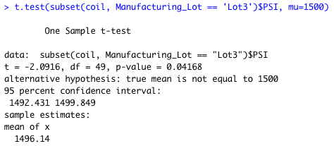

# MechaCar_Statistical_Analysis
MechaCar_Statistical_Analysis

## Linear Regression to Predict MPG

___Output:___

___Q&A___

Q: Which variables/coefficients provided a non-random amount of variance to the mpg values in the dataset?

A: 0.1077

Is the slope of the linear model considered to be zero? Why or why not?

A: No, the slope of the linear model is not considered to be zero because of the p value, which shows the significance difference.

Does this linear model predict mpg of MechaCar prototypes effectively? Why or why not?

A: According to R, the R square of 0.7119 shows that only 71.19% of the variance can be explained by the independent variable in this regression model. This linear model does not predict mpg of MechaCar protopyes effectively. 

[Investopedia Source about R-Squared](https://www.markdownguide.org/basic-syntax/)

## Create Visualizations for the Trip Analysis

___Output:___

___Q&A:___

Q: The design specifications for the MechaCar suspension coils dictate that the variance of the suspension coils must not exceed 100 pounds per square inch. Does the current manufacturing data meet this design specification for all manufacturing lots in total and each lot individually? Why or why not?

A: Per R, the variance of the suspension coils meets the design specifications in Lot1, Lot2, and Total. However, Lot3 individually, does not meet the specifications due to exceeding 100 (exact numnber: 170.2861224) pounds per square inch of variance. 

## T-Tests on Suspension Coils
___Output:___

___Analysis:___

Based on the ouput images, t.test for PSIs of all manufacturing lots shows a p value of 0.06028, indicating there's a decent strong evident that there's a statistically difference between the means from our datset and the population.

The p values for Lot1 and Lot2 are 1, and 0.6072. This means that we cannot reject our hypothesis that there's no sigfinicant difference between the means from population and our dataset. But, for Lot3, the p-value is 0.04168, indicating that the mean from our dataset is statistically different from the population.

## Study Design: MechaCar vs Competition

___Analysis:___

In my opinion, the most critical factor always come down to the price of the vehicle, maintenance cost, and fuel efficiency. Most of the people focus on how much it will cost to maintain a functional car. In this statistical study, we would need to collect enough data to compare vehicle information against vehicle from competitors. Our null hypothesis would be that MechaCar vehicles are not different than the vehicles from the other competitors/larger cool of population. In this case, we would use a statistical test, t-test, to compare the mean of one dataset to another (population for instance). 